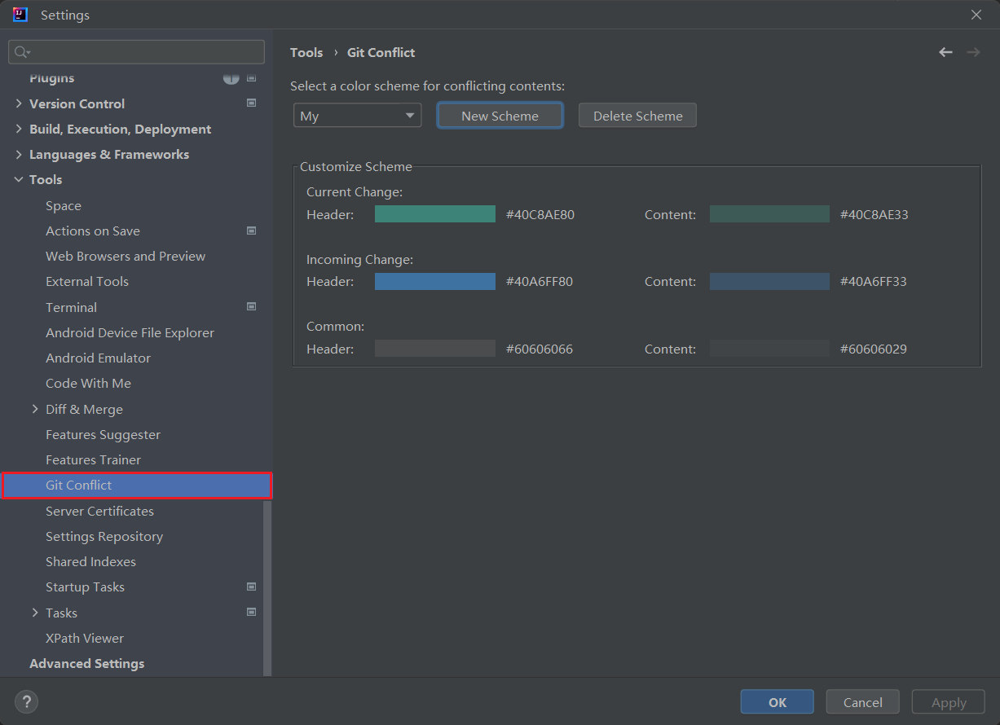

# git-conflict

一款 JetBrains IDEA / Android Studio 等 Jetbrains IDE 的 `Git` 冲突 **高亮显示** 的插件。

## How to Install

- 在 [GitHub Releases](https://github.com/liying2008/git-conflict/releases) 页面下载最新的 `zip` 包，然后通过 `Settings -> Plugins -> Install plugin from disk..` 选择下载的 `zip` 包安装；

- 或者在 `Settings -> Plugins -> Marketplace` 里面搜索 `Git Conflict` 。

## How to Use

**高亮显示冲突：** 打开包含冲突的文件，然后在编辑区域右键选择 `Highlight Git Conflict` （快捷键 `shift ctrl G`），就可以看到冲突部分被高亮显示了：

**取消高亮显示冲突：** 在编辑区域再次右键，选择 `Cancel Highlight Git Conflict` （快捷键 `shift ctrl alt G`）即可。

**快速解决冲突：** 在高亮状态下，在编辑区域右键，可看到 `Fix Git Conflict` 菜单组里提供了三种解决冲突的预置方案：
- *Accept Current Change:*  采用当前更改
- *Accept Incoming Change:*  采用传入的更改
- *Accept Both Changes:*  保留双方更改

**Screenshot:**

**设置面板：** 通过 `Settings -> Tools -> Git Conflict` 进入设置面板，选择自己喜欢的颜色方案：

## Contact Me

Email：[liruoer2008@yeah.net](mailto:liruoer2008@yeah.net)  
